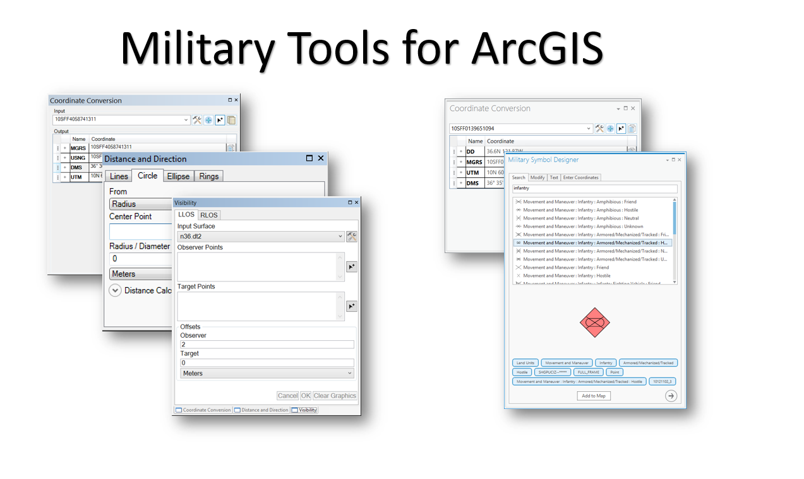

# military-tools-for-arcgis
Military Tools for ArcGIS combines several mission-focused ArcGIS enhancements for defense and intelligence. 

This repository serves as a container repository that is used to distribute several related repositories (see [Resources](#resources) section) as a single installable Add-in toolbar.



## Features
* Toolbar - Set of Military Tools for ArcGIS
	* Show command for Coordinate Conversion
	* Show command for Distance and Direction
	* Show command for Visibility
* Addin for ArcMap 10.3.1

## Sections

* [Requirements](#requirements)
* [Instructions](#instructions)
* [Resources](#resources)
* [Issues](#issues)
* [Contributing](#contributing)
* [Licensing](#licensing)

## Requirements

### Developers 

* Visual Studio 2013
* ArcGIS Desktop SDK for .NET 10.3.1
	* [ArcGIS Desktop for .NET Requirements](https://desktop.arcgis.com/en/desktop/latest/get-started/system-requirements/arcobjects-sdk-system-requirements.htm)

### ArcGIS for Desktop Users

* [ArcGIS Desktop 10.3.1](http://desktop.arcgis.com/en/arcmap/10.3/get-started/system-requirements/arcgis-desktop-system-requirements.htm)
	* ArcMap

## Instructions

## Devs
* Building
	* To Build Using Visual Studio
		* Open and build solution file
	* To use MSBuild to build the solution
		* Open a Visual Studio Command Prompt: Start Menu | Visual Studio 2013 | Visual Studio Tools | Developer Command Prompt for VS2013
		* ``` cd Military-Tools-For-ArcGIS\source\ArcMapAddinMAToolbar ```
		* ``` msbuild ArcMapAddinMAToolbar.sln /property:Configuration=Release ```

## Users
* Running
	* To run from a stand-alone deployment
		* ArcMap
			* Install the add-in from the ``` application\addins ``` folder by double clicking ``` InstallMilitaryToolsForArcGIS.bat ```
			* Enable the toolbar by right clicking ArcMap toolbar area and checking "Military Tools for ArcGIS" 
				* Toolbar appears with commands to show each military tool

## Adding an AddIn to the Military Tools for ArcGIS
* Copy your AddIn to the ``` application\addins ``` folder
* Edit the ``` InstallMilitaryToolsForArcGIS.bat ``` and add an install line for your AddIn at the top of the file
* Open the solution and add a reference to your AddIn command in the ``` Config.esriaddinx ``` file
* Re-compile solution
* Add newly compiled ``` ArcMapAddinMAToolbar.esriAddIn ``` to the ``` application\addins ``` folder
* Test changes to batch file for correctness

## Resources

* [ArcGIS 10.3 Help](http://resources.arcgis.com/en/help/)
* [ArcGIS Blog](http://blogs.esri.com/esri/arcgis/)


### Related repositories:
* [solutions-geoprocessing-toolbox](https://github.com/Esri/solutions-geoprocessing-toolbox)
* [solutions-webappbuilder-widgets](https://github.com/Esri/solutions-webappbuilder-widgets)
* [coordinate-conversion-addin-dotnet](https://github.com/Esri/coordinate-conversion-addin-dotnet)
* [distance-direction-addin-dotnet](https://github.com/Esri/distance-direction-addin-dotnet)

## Issues

Find a bug or want to request a new feature?  Please let us know by submitting an [issue](https://github.com/ArcGIS/Military-Tools-For-ArcGIS/issues).

## Contributing

Esri welcomes contributions from anyone and everyone. Please see our [guidelines for contributing](https://github.com/esri/contributing).

### Repository Points of Contact

###Repository Owner: [Lyle](https://github.com/topowright)

* Merge Pull Requests
* Creates Releases and Tags
* Manages Milestones
* Manages and Assigns Issues

###Secondary: [Matt](https://github.com/mfunk)

* Backup when the Owner is away

## Licensing
Copyright 2015 Esri

Licensed under the Apache License, Version 2.0 (the "License");
you may not use this file except in compliance with the License.
You may obtain a copy of the License at

   http://www.apache.org/licenses/LICENSE-2.0

Unless required by applicable law or agreed to in writing, software
distributed under the License is distributed on an "AS IS" BASIS,
WITHOUT WARRANTIES OR CONDITIONS OF ANY KIND, either express or implied.
See the License for the specific language governing permissions and
limitations under the License.

A copy of the license is available in the repository's [license.txt](./license.txt) file.

[](Esri Tags: ArcGIS ArcMap Toolbar Add-In Military Analyst Defense ArcGISSolutions)
[](Esri Language: .NET)​
